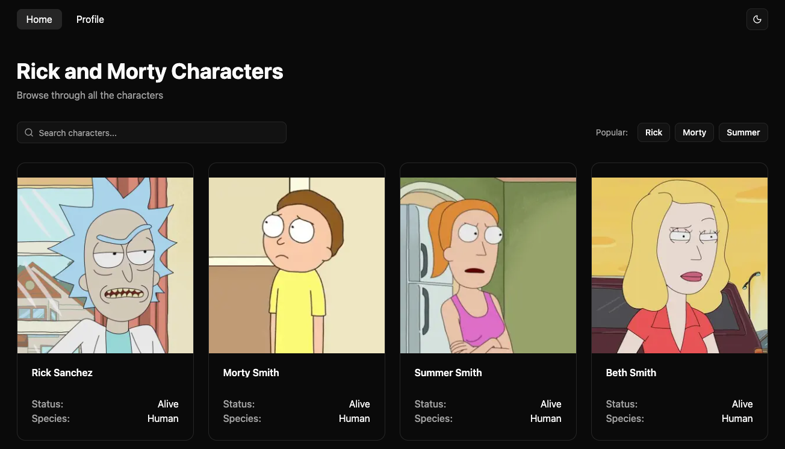

# Leonardo.ai Challenge
Welcome to my submission for the NextJS web app challenge :).

Website is accessible via https://leonardo-challenge-two.vercel.app/.

1. On initial render, middleware will block users from accessing protected routes and website data.
2. Once the user inputs job title and username, their profile information is stored in browser cookie with required options to improve security like preventing XSS, with an expirty e.g. (http only, secure, sameTime, maxAge).
3. RESTful user profile API's grouped in `src/api/(rest)/v1/user/route.ts`, using appropriate HTTP verbs (GET, POST, PATCH, DELETE). This is where user profile is created/updated and cookies are set/fetched.
4. Home page renders a  grid of character cards with minimal information.
5. Home page is using SSR for the initial few pages to improve page rendering performance, then CSR for additional pages accessed via pagination.
6. When you click on a card, it will open a modal with additional information about the character.
7. You can also access character details via dynamic route e.g. https://leonardo-challenge-two.vercel.app/characters/1. This dynamic route is not using SSR yet.



## Getting Started

First install the dependencies:

```bash
npm install
```

Then, run the development server:

```bash
npm run dev
```

Open [http://localhost:3000](http://localhost:3000) with your browser to see the result.

## Testing
To test payload validation on API endpoint run:

```bash
curl -X POST -H "Content-Type: application/json" -d '{"username": "a", "jobTitle": "a"}' localhost:3000/api/v1/user
```